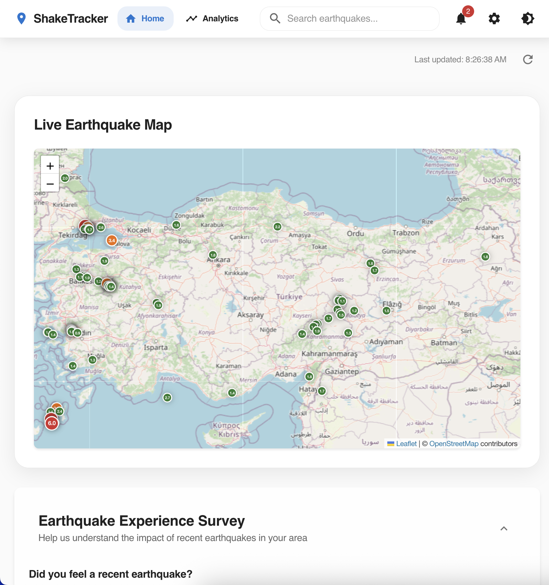
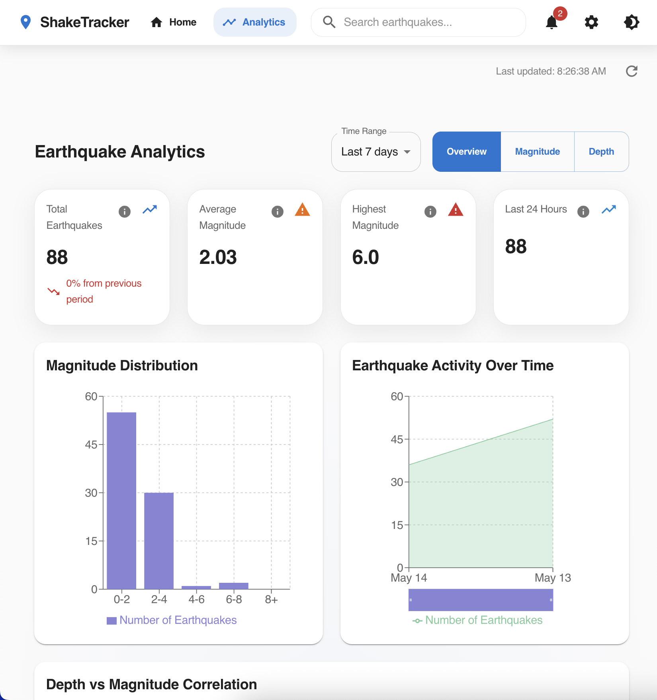
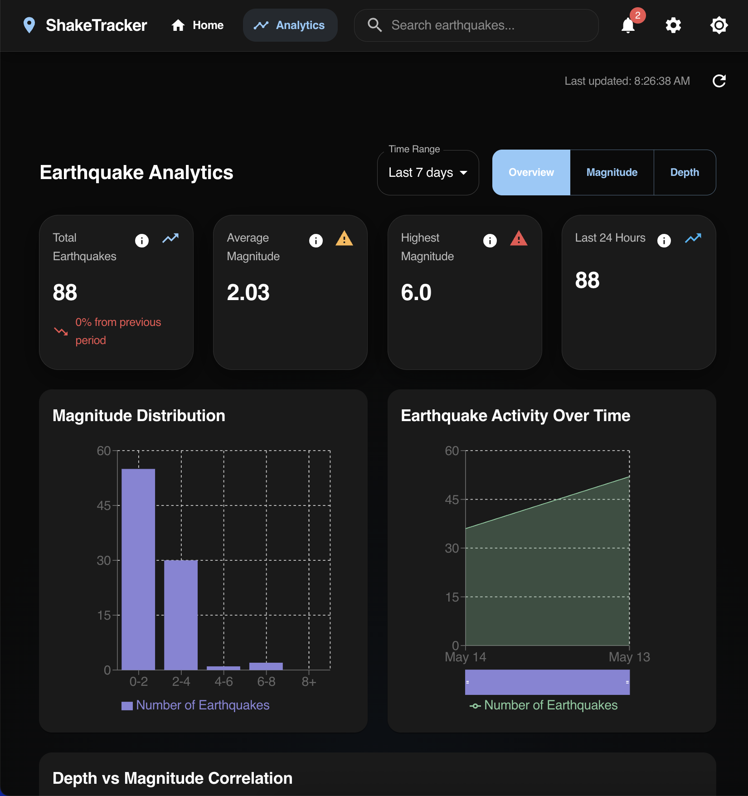

# 🌍 Shake Tracker

[](https://github.com/yourusername/shake-tracker/actions/workflows/ci.yml)
[](https://github.com/yourusername/shake-tracker/actions/workflows/deploy.yml)
[](https://github.com/yourusername/shake-tracker/actions/workflows/ci.yml)
[](https://opensource.org/licenses/MIT)
[](https://nodejs.org/)

A modern, real-time earthquake tracking application built with React, TypeScript, and Material-UI. Monitor seismic activities around the world with an intuitive and beautiful interface.

## 📸 Screenshots

### Main Dashboard


_Real-time earthquake map and recent activity list_

### Analytics View


_Detailed earthquake analytics and statistics_

### Dark Mode


_Application in dark mode_

## ✨ Features

- 🌐 Real-time earthquake data visualization
- 📊 Interactive map with earthquake locations
- 📈 Comprehensive analytics dashboard
- 🌙 Dark/Light mode support
- 📱 Responsive design for all devices
- 🔄 Auto-refresh functionality
- 🔍 Advanced search and filtering
- 📍 Location-based earthquake tracking

## 🚀 Getting Started

### Prerequisites

- Node.js (v16 or higher)
- npm or yarn

### Installation

1. Clone the repository:

```bash
git clone https://github.com/yourusername/shake-tracker.git
cd shake-tracker
```

2. Install dependencies:

```bash
npm install
# or
yarn install
```

3. Start the development server:

```bash
npm run dev
# or
yarn dev
```

4. Open [http://localhost:5173](http://localhost:5173) in your browser.

## 🧪 Testing

This project includes comprehensive testing with Playwright:

```bash
# Run all tests
npm test

# Run tests in Chrome only
npm run test:chrome

# Run Lighthouse performance tests
npm run test:lighthouse

# Run tests with UI mode
npm run test:ui
```

## 🚀 CI/CD Pipeline

This project uses GitHub Actions for continuous integration and deployment:

### Workflows

- **CI** - Runs on every push and PR to main/develop branches
  - ✅ ESLint and TypeScript checking
  - ✅ Build verification
  - ✅ End-to-end tests with Playwright
  - ✅ Lighthouse performance audits
  - ✅ Security vulnerability scanning

- **Deploy** - Automatic deployment to production
  - 🚀 Deploys to GitHub Pages, Netlify, and Vercel
  - 📊 Post-deployment smoke tests
  - 📱 Slack notifications

- **Pull Request Checks** - Enhanced PR workflow
  - 📝 Automatic PR analysis and comments
  - 🎨 Visual regression testing
  - 📊 Performance impact analysis
  - 📦 Bundle size monitoring

- **Dependency Management** - Weekly dependency updates
  - 🔒 Security audit scanning
  - 📦 Automated dependency updates
  - 🤖 Auto-generated update PRs

### Performance Monitoring

- Lighthouse audits run on every PR and deployment
- Performance regression detection
- Bundle size tracking
- Core Web Vitals monitoring

## 🛠️ Built With

- [React](https://reactjs.org/) - Frontend framework
- [TypeScript](https://www.typescriptlang.org/) - Type safety
- [Material-UI](https://mui.com/) - UI components
- [Vite](https://vitejs.dev/) - Build tool
- [React Router](https://reactrouter.com/) - Routing
- [USGS Earthquake API](https://earthquake.usgs.gov/fdsnws/event/1/) - Data source

## 📦 Project Structure

```
shake-tracker/
├── src/
│   ├── components/     # React components
│   ├── services/       # API services
│   ├── types/         # TypeScript types
│   ├── utils/         # Utility functions
│   └── App.tsx        # Main application component
├── public/            # Static assets
└── docs/             # Documentation and screenshots
```

## 🤝 Contributing

1. Fork the repository
2. Create your feature branch (`git checkout -b feature/AmazingFeature`)
3. Commit your changes (`git commit -m 'Add some AmazingFeature'`)
4. Push to the branch (`git push origin feature/AmazingFeature`)
5. Open a Pull Request

## 📝 License

This project is licensed under the MIT License - see the [LICENSE](LICENSE) file for details.

## 🙏 Acknowledgments

- USGS for providing the earthquake data API
- Material-UI for the beautiful component library
- All contributors who have helped shape this project

---

Made with ❤️ by [Your Name]
